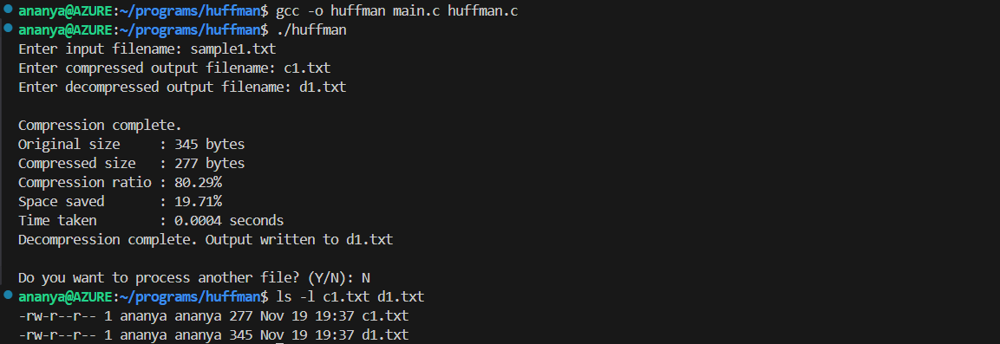

# DSA PROJECT 

## Problem statement

This project involves building a terminal-based program that compresses files to save storage space and speed up transfers. The program should implement Huffman Coding or Run-Length Encoding (RLE) to reduce file size while ensuring the file can be perfectly restored. The program will read a file, compress it, and then allow decompression back to the original file, displaying compression ratios and time taken.

## Usage 

* On your terminal, navigate to the directory where these files are stored.

* Run the command `gcc -o huffman main.c huffman.c` to compile.

* Then, run the command `./huffman` to run the files.

## Sample output

This example is using the file "sample.txt."

---

